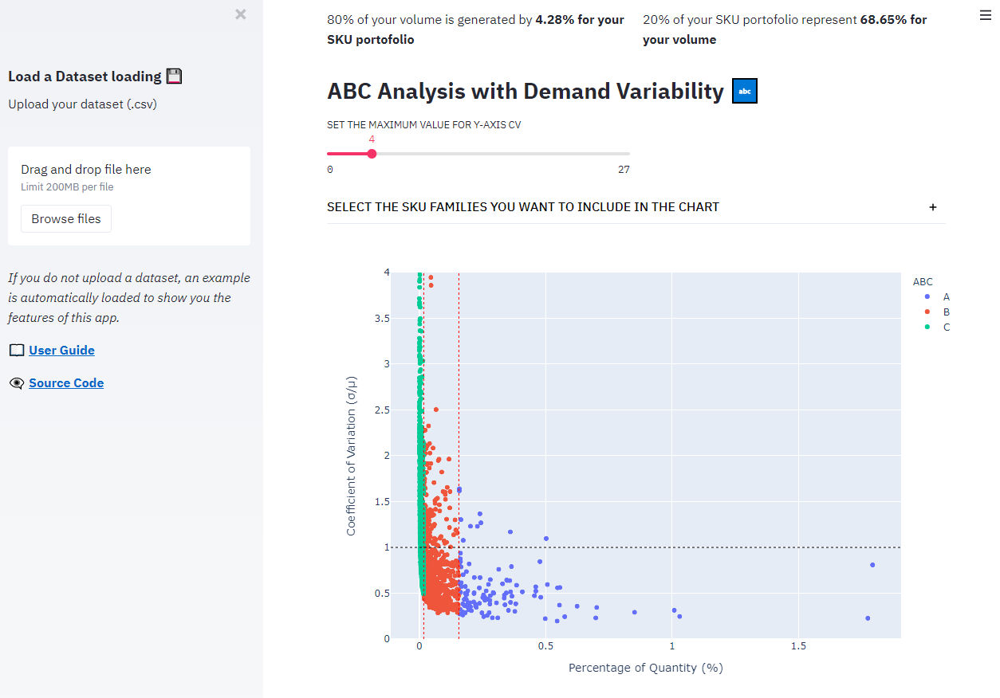
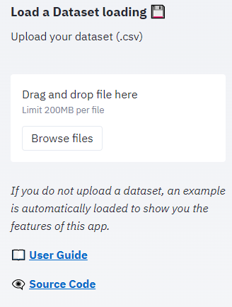
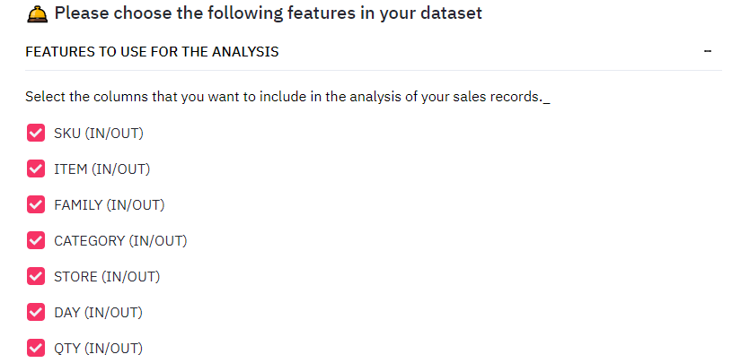
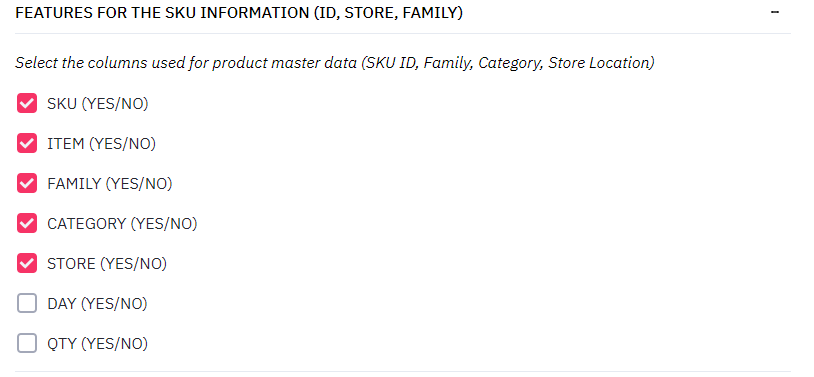
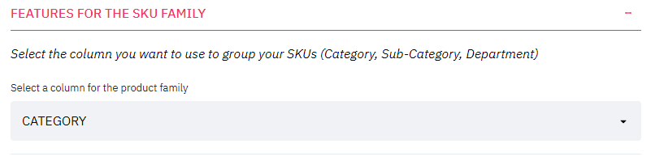
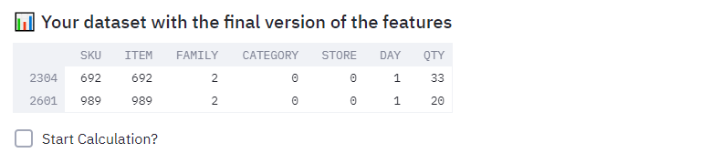

# Automate Product Segmentation with this Streamlit Web Application 📈
*A statistical methodology to segment your products based on turnover and demand variability*

  

Product segmentation refers to the activity of grouping products that have similar characteristics and serve a similar market. It is usually related to marketing _(Sales Categories)_ or manufacturing _(Production Processes)_. However as a **Supply Chaine Engineer** your focus is not on the product itself but more on the complexity of managing its flow.

Your want to understand the sales volumes distribution (fast/slow movers) and demand variability to optimize your production, storage and delivery operations to ensure the best service level by considering: 
- The highest contribution to your total volume: ABC Analysis
- The most unstable demand: Demand Variability

I have designed this **Streamlit App** to provide a tool to **Supply Chain Engineers** for Product Segmentation, with a focus on retail products, of their portofolio considering the complexity of the demand and the volumes contribution of each item.

### Medium Article
In this [Medium Article](https://towardsdatascience.com/product-segmentation-for-retail-with-python-c85cc0930f9a), you can find details about the theory used to build this tool. 

# Acces the appplication 🖥️ 
Here: [Product Segmentation for Retail](https://share.streamlit.io/samirsaci/segmentation/segmentation.py)

# How can you use it?
This Streamlit Web Application has been designed for Supply Chain Engineers to support them in their Inventory Management. It will help you to automate product segmentation using statistics.

## **Step 1: What do you want to do?**
You have two ways to use this application:
- 🖥️ Look at the results computed by the model using the pre-loaded dataset: in that case you just need to scroll to see the visuals and the analyses
OR
- 💾 Upload your dataset of sales records that includes columns related to:
  - **Item master data**
  _For example: SKU ID, Category, Sub-Category, Store ID_
  - **Date of the sales**:
  _For example: Day, Week, Month, Year_
  - **Quantity or value**: this measure will be used for the ABC analysis
  _For example: units, cartons, pallets or euros/dollars/your local currency_

## **Step 2: Prepare the analysis**

1. 💾 Upload your dataset of sales records

  

💡 _Please make sure that you dataset format is csv with a file size lower than 200MB. If you want to increase the size, you'd better copy this repository and deploy the app locally following the instructions below._
2. 📅 [Parameters] select the columns for the date (day, week, year) and the values (quantity, $)

  

💡 _If you have several columns for the date (day, week, month) and for the values (quantity, amount) you can use only one column per category for each run of calculation._

3. 📉 [Parameters] select all the columns you want to keep in the analysis

  

💡 _This step will basically help you to remove the columns that you do not need for your analysis to increase the speed of computation and reduce the usage of ressources._
4. 🏬 [Parameters] select all the related to product master data (SKU ID, FAMILIY, CATEGORY, STORE LOCATION)

  

💡 _In this step you will show at what granularity you want to do your analysis. For example it can be at:
  - Item, Store level: that means the same item in two stores will represent two SKU
  - Item ID level: that means you group the sales of your item in all stores
  ...
_
5. 🛍️ [Parameters] select one feature you want to use for analysis by family

  

💡 _This feature will be used to plot the repartition of (A, B, C) product by family_
6. 🖱️ Click on Start Calculation? to launch the analysis

  

💡 _This feature will be used to plot the repartition of (A, B, C) product by family_

This repository code you will find all the code used to explain the concepts presented in the article.

# About me 🤓
Senior Supply Chain Engineer with an international experience working on Logistics and Transportation operations. \
Have a look at my portfolio: [Data Science for Supply Chain Portfolio](https://samirsaci.com) \
Data Science for Warehousing📦, Transportation 🚚 and Demand Forecasting 📈 
